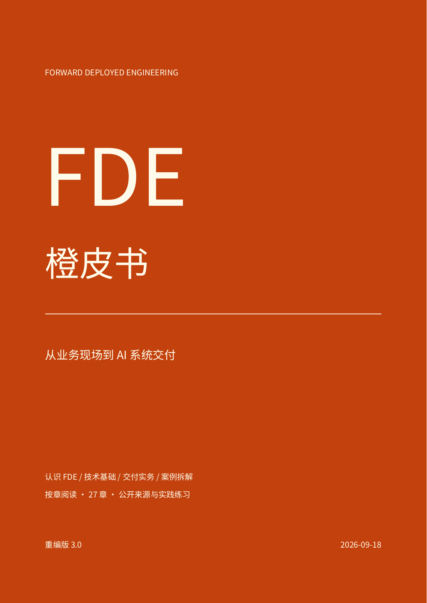

# FDE橙皮书

### 从业务现场到 AI 系统交付

一本面向转型工程师、企业 AI 交付人员与业务负责人的中文实践书。先建立岗位、业务和技术基础，再沿着需求、试点、上线与交接学习交付，最后用真实案例检查方法。



重编版 3.0 · 2026 年 9 月 18 日 · 四篇 27 章 · 整本 PDF 63 页

**[下载整本 PDF](https://github.com/hehuihuang/-fde-orange-book-knowledge-base/raw/refs/heads/main/dist/FDE%E6%A9%99%E7%9A%AE%E4%B9%A6.pdf)** · [从阅读说明开始](book/00-阅读说明.md) · [独立目录](book/目录.md)

每章都是独立 Markdown，点击下方章节即可在线阅读。也可[下载暖色阅读版 HTML](https://github.com/hehuihuang/-fde-orange-book-knowledge-base/raw/refs/heads/main/dist/FDE%E6%A9%99%E7%9A%AE%E4%B9%A6.html)；完整下载仓库后打开 `dist/FDE橙皮书.html`，即可使用目录、章节导航、三种暖色纸色和字号调整，PDF 下载按钮也可用。GitHub 文件页只展示 HTML 源码，阅读版尚未部署为网站。

## 全书目录

### 第一篇　认识 FDE

先理解工作与责任，再判断什么问题值得解决。

1. [FDE 的工作与责任](book/01-FDE的工作与责任.md)
2. [用业务流程理解问题](book/02-用业务流程理解问题.md)
3. [价值指标与成本](book/03-价值指标与成本.md)
4. [能力地图与协作边界](book/04-能力地图与协作边界.md)

### 第二篇　技术基础

把模型、数据与工具放进可以验证的系统。

5. [大模型与上下文](book/05-大模型与上下文.md)
6. [数据、接口与业务对象](book/06-数据接口与业务对象.md)
7. [RAG 与企业知识](book/07-RAG与企业知识.md)
8. [工作流、Agent 与 MCP](book/08-工作流Agent与MCP.md)
9. [评测与错误分析](book/09-评测与错误分析.md)
10. [权限、安全与人工控制](book/10-权限安全与人工控制.md)

### 第三篇　交付实务

从现场观察到生产运行，把结果交到能够继续维护的人手里。

11. [需求发现与现场访谈](book/11-需求发现与现场访谈.md)
12. [范围与验收约定](book/12-范围与验收约定.md)
13. [原型与受控试点](book/13-原型与受控试点.md)
14. [生产发布与回退](book/14-生产发布与回退.md)
15. [可观测性与故障处理](book/15-可观测性与故障处理.md)
16. [用户采用与运营交接](book/16-用户采用与运营交接.md)
17. [团队组织与复用](book/17-团队组织与复用.md)
18. [学习路线与作品集](book/18-学习路线与作品集.md)

### 第四篇　案例拆解

最后一篇集中讲案例，每章包含公开事实、证据等级、本书分析、可复用工作包与资料缺口。

19. [Airbus，让数据进入维修决策](book/19-Airbus让数据进入维修决策.md)
20. [Tampa General，医院运营协同](book/20-TampaGeneral医院运营协同.md)
21. [Morgan Stanley，把评测放进开发](book/21-MorganStanley把评测放进开发.md)
22. [BBVA，从试用走向组织采用](book/22-BBVA从试用走向组织采用.md)
23. [TIME，在固定期限内交付](book/23-TIME在固定期限内交付.md)
24. [GitLab，区分产品与内部应用](book/24-GitLab区分产品与内部应用.md)
25. [Assembled，客服系统的韧性](book/25-Assembled客服系统的韧性.md)
26. [Klarna，自动化指标的边界](book/26-Klarna自动化指标的边界.md)
27. [Datawhale，从具体业务开始](book/27-Datawhale从具体业务开始.md)

## 资料与延伸阅读

书中链接企业官方案例、工程文档及公开培训课程。公司自述与独立审计有不同含义，案例未披露的架构、人员、成本与因果关系会保留为未知。X 与社区用于发现线索，不能单凭热度证明效果。

- [Datawhale FDE100](https://fde100.datawhale.cn/cases)，补充制造业培训与工业物料实践。
- [范冰的公开 FDE 指南](https://github.com/xdash/FDE-the-Guidance-Book-of-Forward-Deployed-Engineer)，推荐原作。本书独立编写，不复制其正文，其商业改编需作者授权。
- Palantir、Anthropic、Hugging Face、DeepLearning.AI 的学习入口集中在[第 18 章](book/18-学习路线与作品集.md)。
- [公开来源台账](research/01-source-ledger.md)记录材料与限制，[更新记录](CHANGELOG.md)记录版本变化。

## 配套与旧版

新版以 `book/` 为主稿。此前的书稿、详细研究与社区专题继续保留，供查证和深入阅读。

- [项目模板](templates/README.md)
- [八个海外案例的扩展研究](knowledge-base/03-海外案例/00-案例索引.md)
- [社区 Top 100 延伸资料](knowledge-base/07-中国社区实践/02-破局FDE点赞Top100分类索引.md)
- [旧版书稿](manuscript/00-frontmatter.md)
- [旧版 PDF](dist/FDE橙皮书-从业务问题到生产系统-v1.0.pdf) · [旧版 Word](dist/FDE橙皮书-从业务问题到生产系统-v1.0.docx)

项目展示名为《FDE橙皮书》，原 GitHub 地址继续使用，便于已有链接访问。

## 使用与维护

授权条款见 [LICENSE.md](LICENSE.md)，第三方事实、课程与商标归原权利人。本项目为独立资料，不代表案例企业或培训机构立场。

内容维护者修改章节 Markdown 与 `book/book.json`，再生成同源目录、PDF 和阅读版。

```bash
uv run --with reportlab --with fonttools --with markdown-it-py --with pypdf python scripts/build_edition.py
python3 scripts/validate_kb.py
uv run --with pypdf python scripts/validate_book.py
```

旧版 Word 仍可用 `uv run --with python-docx python build_book.py` 单独生成，不覆盖新版 PDF。
